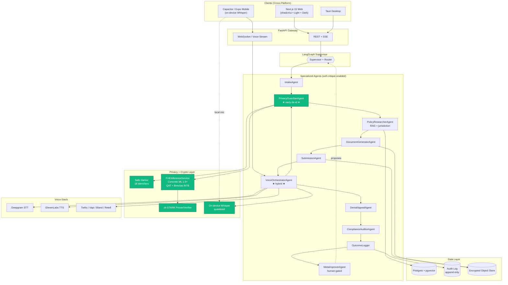
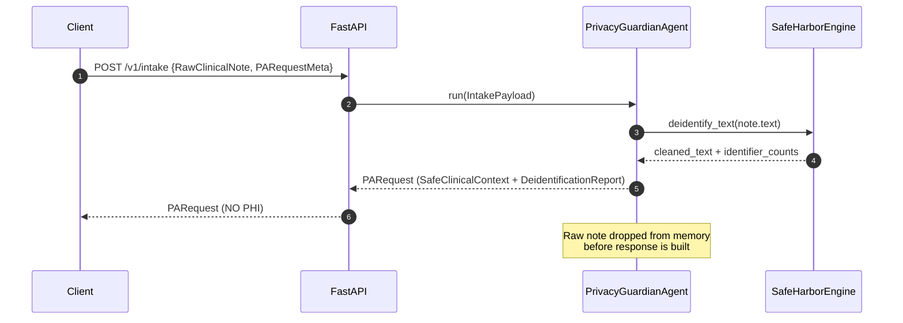
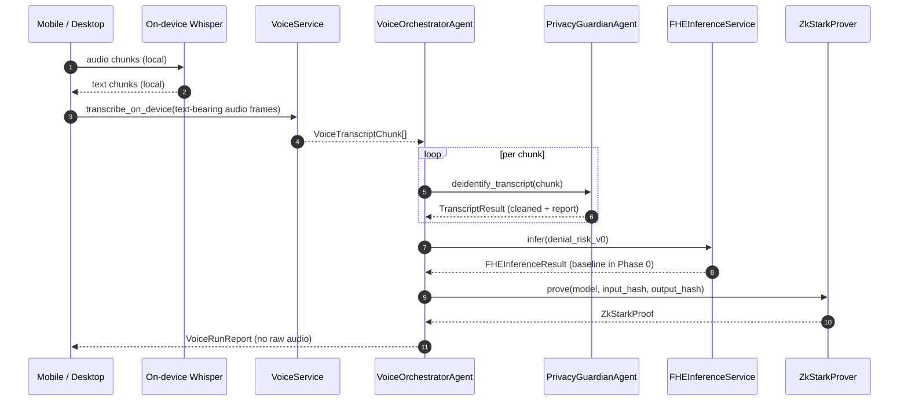

# PriorAuthGuard — Architecture

## 1. High-level view



## 2. Trust boundaries

| Boundary | What crosses | Enforced by |
|---|---|---|
| Client → API | De-identified payloads only (for non-voice). Voice goes over a separate WS channel. | API contract (`RawClinicalNote` is permitted only at `/v1/intake`; PrivacyGuardian runs immediately). |
| API → Agent graph | `PARequest` (de-identified). | `PrivacyGuardianAgent.run(...)` is the only producer. |
| Agent → FHEInferenceService | `FHEInferenceRequest` with `SensitivityTier != PHI_RAW`. | `FHEInferenceService._validate_sensitivity`. |
| FHE → Plaintext baseline | Plaintext baselines never see PHI; only features derived from `SafeClinicalContext`. | Convention + tests. |
| Voice → Storage | De-identified transcript chunks only. | `VoiceOrchestratorAgent` always routes through `PrivacyGuardianAgent.deidentify_transcript`. |

## 3. Sequence: clinical-note intake (Phase 0)



## 4. Sequence: hybrid voice — inbound dictation (Phase 0)



## 5. FHE inference pattern (Concrete ML)

Phase 2 lands the real circuits; Phase 0 ships the interface and bookkeeping.

```
QAT (Brevitas, INT8) ─► PyTorch fp32 export ─► concrete.ml.compile_torch_model
                                                       │
                                                       ▼
                              CompiledModel  ◄─── circuit optimizations
                                       │            (graph rewrite, const fold,
                                       │             operator fusion)
                                       ▼
Client.gen_keys() ─► encrypt(features) ─► server.run(ct) ─► client.decrypt(ct')
                                                                       │
                                                                       ▼
                                                       ZkStarkProver.prove(...)
```

Targets (per the 2025–2026 healthcare FHE benchmarks referenced in the spec):
- Latency: sub-second to low single-digit seconds for tabular QAT-INT8 models.
- Throughput: 64–80 tokens/sec achievable on LoRA-quantized LLMs.
- Bit-width: 6–8 bits; default 8 (`PAG_FHE_QUANT_BITS=8`).

## 6. Jurisdiction routing

| Jurisdiction | `Jurisdiction` enum | Narrowed by |
|---|---|---|
| US (federal) | `us-federal` | – |
| US (state) | `us-state` | `state_code` |
| Canada (federal) | `ca-federal` | – |
| Canada (province) | `ca-province` | `province_code` |
| United Kingdom | `uk` | – |

`PolicyResearcherAgent` (Phase 1) keys its RAG retrieval on the
`JurisdictionTag` so payer rules and consent frameworks (HIPAA / PIPEDA /
provincial / UK GDPR + DPA 2018 + NHS DSPT) are applied correctly.
